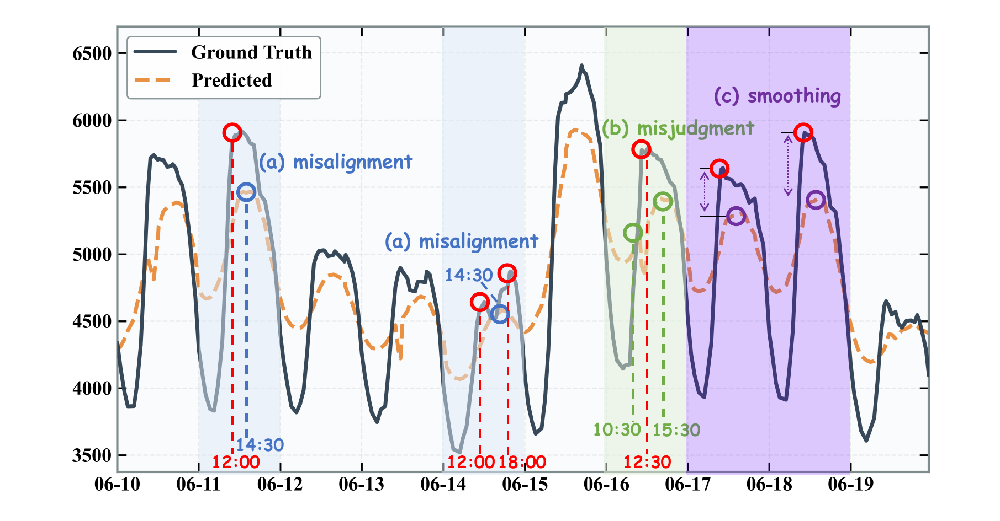
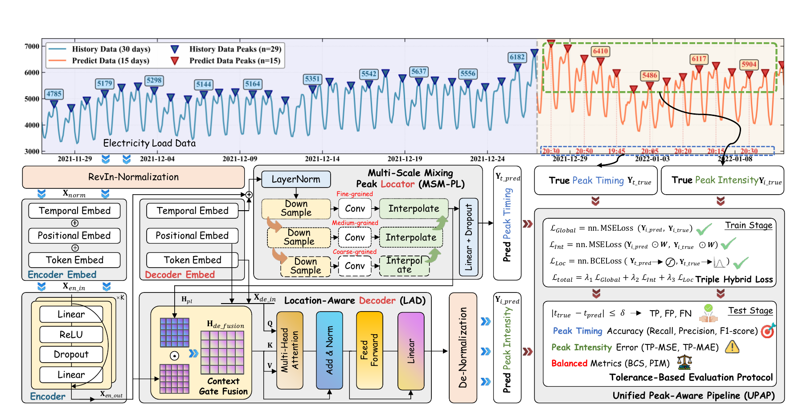

# 📊 PeakFocus：面向电力负荷预测的统一多尺度峰值定位与强度回归框架

[English README](README.md)

## 💡 项目背景

现代电力系统持续采集城市及区域级高分辨率负荷数据，时间序列数据管理已成为电网调度、需求响应和备用容量管理的核心基础设施。在所有预测查询中，**峰值查询**——预测下一次负荷峰值的*出现时刻*与*峰值幅度*——具有独特的重要性：峰值高估会浪费旋转备用容量，而峰值低估则可能导致设备过载和连锁故障。

然而，峰值属于稀疏结构性事件（在电网级数据集中通常仅占 4–10% 的时间步），而主流深度预测模型采用连续回归目标函数，隐含地假设误差景观是稠密且均匀的。这一错位造成了**稀疏事件稀释**问题：全局重建损失被非峰值样本主导，驱使模型趋向均值回归轨迹，实际上将关键极值当作可忽略的波动处理。

Transformer、MLP 等深度架构虽能有效建模时间动态，但通常依赖 MSE 或 MAE 等全局损失函数，使模型偏向主趋势而忽视稀疏峰值信号。**电力负荷峰值预测（ELPF）**因此作为一项高度专业化的任务应运而生。

现有 ELPF 方法存在固有的结构性局限：两阶段"先预测后定位"范式割裂了时序定位与强度回归之间的联结；近期的端到端方法仍面临**多尺度表示冲突**——粗粒度特征缺乏时间分辨率（导致时序偏移），细粒度特征易受局部波动干扰（导致峰值误判）。此外，即使是统一框架，强度预测也存在**幅值平滑**问题：强度解码器在缺乏显式峰值时序上下文的情况下被全局平滑趋势所压制，系统性地低估峰值幅度。

PeakFocus 正是为解决上述三类局限而设计的端到端框架，将峰值定位与强度回归在统一架构中联合建模。

## 🔥 PeakFocus

PeakFocus 通过峰值感知组件实现端到端训练：


*Fig. 1. PatchTST 在 ELPF 任务中的局限性示意。(a) 时序偏移与 (b) 峰值误判展示了多尺度表示冲突：粗粒度特征缺乏时间分辨率（导致偏移），细粒度特征易受局部波动干扰（导致假阳性）。(c) 幅值平滑展示了缺乏显式峰值时序上下文时的低估现象，强度解码器在无感知状态下被全局平滑趋势所压制。*


*Fig. 2. PeakFocus 整体架构。编码器提取输入特征；MSM-PL 通过多尺度混合解决定位冲突，输出峰值隐藏状态 H_pl 与时序预测 Y_t_pred；LAD 通过上下文门控融合将 H_pl 注入强度回归 Y_i_pred，抑制幅值平滑效应；UPAP 在容差感知语义下通过三重混合目标函数 L_total 确保优化的鲁棒性。*

### ✨ 核心特性

- 🔍 **MSM-PL**：多尺度峰值定位模块
- 🎯 **LAD**：峰值信息引导的解码器
- 📈 **双头训练**：同时做峰值分类和数值回归

---

## 🗂️ 仓库结构

```text
peak-fo/
├── run.py
├── environment.yaml
├── RUN_GUIDE.md
├── figures/
├── data_provider/
├── exp/
├── layers/
├── models/
├── utils/
├── scripts/
├── tools/
├── visualization/
└── docs/
```

---

## 🛠️ 安装

### 环境要求

- Python 3.12（推荐）
- 使用 GPU 时建议配置 CUDA 对应 PyTorch
- Conda 或兼容环境管理工具

### 环境创建

```bash
conda env create -f environment.yaml
conda activate tslib_findpeaks
python run.py --help
```

---

## 🚀 使用方法

以下命令均在仓库根目录执行。

### 1. 运行 PeakFocus（主模型）

```bash
# WLEL
bash scripts/01_main_table/wlel/peakfocus.sh

# ELC
bash scripts/01_main_table/elc/peakfocus.sh
```

### 2. 运行基线模型

当前仓库仅保留论文主实验实际使用到的基线：

- `Transformer`
- `Informer`
- `PatchTST`
- `SegRNN`
- `CycleNet`
- `STID`
- `TimeMixer`
- `Seq2Peak`

```bash
# 主对比批量脚本
bash scripts/01_main_table/wlel/run_all.sh
bash scripts/01_main_table/elc/run_all.sh
```

单模型脚本示例：

```bash
bash scripts/01_main_table/wlel/patchtst.sh
bash scripts/01_main_table/wlel/transformer.sh
bash scripts/01_main_table/wlel/stid.sh
bash scripts/01_main_table/elc/seq2peak.sh
```

### 3. 其他实验组

```bash
# 消融
bash scripts/02_ablation/wlel/wo_lad.sh
bash scripts/02_ablation/elc/wo_msm_pl.sh

# 泛化
bash scripts/03_generality/wlel/vanilla_peakfocus.sh

# 参数敏感性
bash scripts/04_param_sensitivity/k_sweep_244.sh
bash scripts/04_param_sensitivity/loss_weights.sh

# 参数规模
bash scripts/05_param_scaling/dmodel_wlel.sh
bash scripts/05_param_scaling/elayers_elc.sh

# 天气实验
bash scripts/07_weather/weather.sh
```

公共运行参数集中在 `scripts/_common.sh`（如 `PYTHON`、`GPU`、`SEEDS`、`EPOCHS`）。

### 任务类型

| 任务名 | 说明 |
| --- | --- |
| `peak_detect_ltf` | 主任务：峰值感知长时预测 |
| `peak_detect_ltf_basic` | 基线风格预测并进行峰值评估 |
| `seq2peak` | 序列到峰值任务 |
| `long_term_forecast` | 标准长时预测 |
| `short_term_forecast` / `imputation` / `classification` / `anomaly_detection` | 其他支持任务 |

---

## 🤖 模型说明

### PeakFocus（`models/proposed_model.py`）

关键开关：

- `--if_msm_pl 1`：开启 MSM-PL
- `--if_lad 1`：开启 LAD

常用参数：

```bash
--task_name peak_detect_ltf
--model proposed_model
--seq_len 168
--label_len 48
--pred_len 336 or 720
--d_model 256
--d_ff 256
--n_heads 4
--e_layers 1
--mlp_layers 2
```

---

## 📊 输出与结果汇总

### 输出目录

```text
results/[task]_[data]_[model]_[model_id]_[seq_len]_[pred_len]_[itr]/
checkpoints/[task]_[data]_[model]_[model_id]_[seq_len]_[pred_len]_[itr]/
```

常见产物：

- `experiment_log.txt`
- `metrics.npy`
- `pred.npy`
- `true.npy`

### 汇总工具

```bash
python tools/calculate_mean_metrics.py
bash tools/cal.sh
bash tools/cal_seq2peak.sh
python tools/extract_mean_to_excel.py
```

---

## 📐 评估指标与公式

### 预测误差指标

- MSE / MAE / RMSE
- TP_MSE / TP_MAE（仅在匹配成功的峰值对上计算）

设匹配峰值对集合为 \(\mathcal{M}\)，真实峰值索引为 \(t\)，匹配预测索引为 \(\hat{t}\)：

$$
\text{TP-MSE}=\frac{1}{|\mathcal{M}|}\sum_{(t,\hat{t})\in\mathcal{M}}\left(y_{\text{pred},\hat{t}}-y_{\text{true},t}\right)^2
$$

$$
\text{TP-MAE}=\frac{1}{|\mathcal{M}|}\sum_{(t,\hat{t})\in\mathcal{M}}\left|y_{\text{pred},\hat{t}}-y_{\text{true},t}\right|
$$

### 峰值检测指标

$$
\text{Precision}=\frac{TP}{TP+FP},\quad
\text{Recall}=\frac{TP}{TP+FN},\quad
F_1=\frac{2\cdot \text{Precision}\cdot \text{Recall}}{\text{Precision}+\text{Recall}}
$$

### 综合指标

PeakFocus 使用 BCS（Balanced Composite Score）和 PIM（Peak Integrated Metric）。

$$
\text{BCS}=\alpha(1-F_1)+(1-\alpha)\left(1-\frac{1}{1+\text{TP-MSE}}\right)
$$

默认 \(\alpha=0.5\)。

$$
\text{PIM}=\frac{1+\text{TP-MSE}}{F_1+\epsilon}
$$

默认 \(\epsilon=0.01\)。BCS/PIM 越低，峰值感知性能越好。

---

## 🧩 可视化

### 论文图表脚本

```bash
python visualization/code/paper_figures/plot_ablation_combined.py
python visualization/code/paper_figures/plot_generality_bar.py
python visualization/code/paper_figures/plot_parameter_panel.py
python visualization/code/paper_figures/plot_radar.py
python visualization/code/paper_figures/plot_scaling_lines.py
```

### 可解释性脚本

```bash
python visualization/code/model_analysis/visualize_attn_heatmap.py
python visualization/code/model_analysis/visualize_gate.py
python visualization/code/model_analysis/visualize_gate_combined.py
python visualization/code/model_analysis/visualize_interpretability.py
```

---

## 📚 相关文档

- 运行指南：`RUN_GUIDE.md`
- 脚本目录：`scripts/README.md`
- 工具目录：`tools/README.md`

---

## 📖 引用

如果本项目对您的研究有帮助，请引用我们的工作：

```bibtex
@article{yu2026peakfocus,
  title={PeakFocus: Bridging Peak Localization and Intensity Regression via a Unified Multi-Scale Framework for Electricity Load Forecasting},
  author={Yu, Wangzhi and Zhu, Peng and Zhao, Qing and Jiang, Yiwen and Cheng, Dawei},
  journal={arXiv preprint arXiv:2605.21550},
  year={2026}
}

@article{yu2026large,
  title={Large Language Models for Time Series Analysis: Methodologies, Applications, and Emerging Challenges},
  author={Yu, Wangzhi and Cheng, Dawei and Zhu, Lizhao and Jiang, Changjun},
  year={2026},
  publisher={TechRxiv}
}
```
